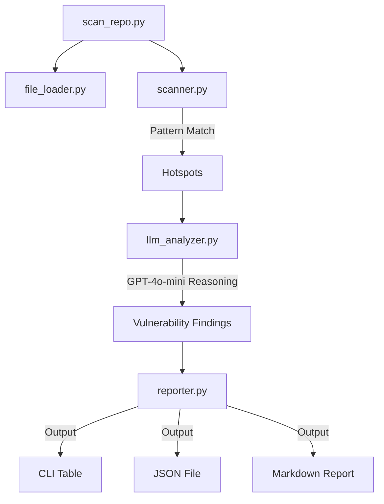

# 🛡️ RepoGuard: AI-Powered Security Scanner

A high-performance CLI tool designed to identify both **traditional security vulnerabilities** and **modern AI/LLM-specific risks** in your codebases. 

[](https://www.python.org/)
[](https://openai.com/)

---

## 🔥 Why RepoGuard?

Traditional static analysis security tools (SAST) often suffer from high false-positive rates and struggle with the dynamic nature of modern AI applications. **RepoGuard** stands out by combining the speed of pattern matching with the deep contextual reasoning of Large Language Models (LLMs).

### 🚀 How RepoGuard Stands Out:
- **Context-Aware Auditing**: Unlike simple regex-based tools, RepoGuard uses AI to understand *intent*. It doesn't just find a dangerous function; it reasons whether it's actually vulnerable in the context of your code.
- **AI-Native Security**: Specialized specifically for the modern AI stack. We detect **Prompt Injection**, **Vector DB Poisoning**, and **Unsafe Agent Tools**—vulnerabilities that traditional scanners completely miss.
- **Zero-Config Intelligence**: No need for complex rule tuning. The LLM handles the complex security logic, providing instant, human-readable remediation advice for every finding.
- **Continuous Learning**: By leveraging GPT-4o-mini, RepoGuard stays updated on the latest exploit patterns without requiring manual engine updates.

---

## 🚀 Key Features

### 1. Traditional Security Scan (CORE)
- **Hardcoded Secrets**: Detection of API keys, tokens, and passwords.
- **SQL Injection**: Identification of unsanitized input in database queries.
- **Unsafe Calls**: Detection of `eval()`, `exec()`, and dangerous system calls.

### 2. AI Security Audit (New!)
- **AI Stack Detection**: Automatically recognizes frameworks like LangChain, OpenAI, Pinecone, and ChromaDB.
- **Prompt Injection**: Identifies risks where user input is directly injected into LLM prompts.
- **Unsafe Tool Usage**: Audits LLM agents with high-privilege tool access (e.g., Shell access).
- **Vector DB Poisoning**: Detects unvalidated data ingestion into vector stores.

### 3. Professional Capabilities
- **Remote Scanning**: Scan any Git repository via URL with automatic cleanup.
- **Shallow Cloning**: Fast remote scans using `--depth 1`.
- **Flexible Reporting**: Export findings to CLI, JSON, or professional Markdown (README format).

---

## 🏗 Architecture



---

## 🛠 Installation

1. **Clone the repo**:
   ```bash
   git clone <repo_url>
   cd ai_security_scanner
   ```

2. **Setup Virtual Environment**:
   ```bash
   python3 -m venv venv
   source venv/bin/activate
   ```

3. **Install Dependencies**:
   ```bash
   pip install -r requirements.txt
   ```

4. **Configure OpenAI API**:
   Create a `.env` file in the root directory:
   ```env
   OPENAI_API_KEY=your_key_here
   OPENAI_MODEL=gpt-4o-mini
   ```

---

## 📖 Usage

### Scan a Local Directory
```bash
python3 scan_repo.py /path/to/your/repo
```

### Scan a Remote Git URL
```bash
python3 scan_repo.py https://github.com/user/repo --branch main
```

### Generate a Markdown Report
```bash
python3 scan_repo.py . --markdown SECURITY_REPORT.md
```

---

## 🛡️ License
Distribute under the MIT License. See `LICENSE` for more information.
